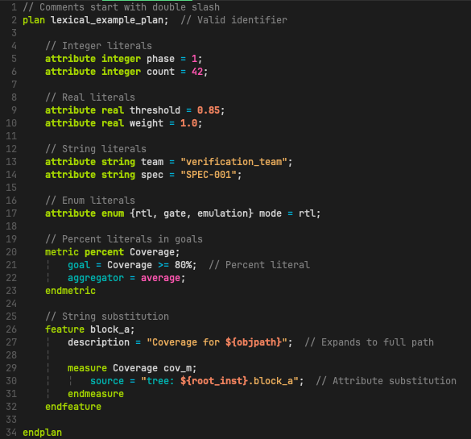

# hvp.vim

Vim and Neovim plugin for [Synopsys HVP](https://www.synopsys.com/) (Hierarchical
Verification Plan) files. Provides syntax highlighting, code folding, block navigation,
comment toggling, and a live preview rendered through
[glow](https://github.com/charmbracelet/glow).



## Features

| Feature | Description |
|---|---|
| **Syntax highlighting** | Keywords, types, operators, strings with embedded source mini-language (`tree:`, `group:`, `property:`, wildcards, backtick operators, `${...}` substitution), percent literals, hierarchy paths, comments with `TODO`/`FIXME`/`YAGNI` |
| **Code folding** | Syntax-based folds on `plan`, `feature`, `metric`, `measure`, `override`, `filter`, `until` blocks |
| **Block navigation** | `%` jumps between matched delimiters (`feature`/`endfeature`, `plan`/`endplan`, etc.) via matchit or [vim-matchup](https://github.com/andymass/vim-matchup) |
| **Comment toggling** | `gc`/`gcc` toggles `//` comments (works with [Comment.nvim](https://github.com/numToStr/Comment.nvim) and [vim-commentary](https://github.com/tpope/vim-commentary)) |
| **`:HvpPreview[!]`** | Renders the HVP file as structured markdown in a glow-powered terminal split (vertical by default, `!` for horizontal) |
| **`<Leader>P`** | Filetype-aware preview -- dispatches to `:HvpPreview` for `.hvp` files, runs `glow` directly for markdown |

### Preview

`:HvpPreview` parses the HVP file into a structured markdown document (document info,
metrics, milestone overrides, plan hierarchy, regression filters) and renders it through
glow in a vertical split:


## Requirements

- Vim 8+ or Neovim 0.9+
- [glow](https://github.com/charmbracelet/glow) -- for `:HvpPreview` and `<Leader>P`
- Python 3 -- for the HVP-to-markdown converter used by `:HvpPreview`

## Installation

### lazy.nvim (Neovim)

```lua
{ "yehudat/hvp.vim", lazy = false },
```

### Vundle (Vim)

```vim
Plugin 'yehudat/hvp.vim'
```

### vim-plug

```vim
Plug 'yehudat/hvp.vim'
```

### packer.nvim

```lua
use 'yehudat/hvp.vim'
```

## HVP Language Reference

The plugin highlights the full HVP grammar as defined in the Synopsys HVP (HVL) DSL
Language Reference:

```
plan <name>;
    attribute <type> <name> = <value>;
    annotation <type> <name> = <value>;
    metric <type> <name>;
        goal = <expression>;
        aggregator = sum | average | min | max | uniquesum;
    endmetric
    feature <name>;
        measure <metric-list> <name>;
            source = "<source-expression>";
        endmeasure
    endfeature
    subplan <plan-name> #(attr=value, ...);
endplan

override <name>;
    <plan>.<feature>.<metric> = <goal-expression>;
endoverride

filter <name>;
    keep feature where <expression>;
    remove feature where <expression>;
endfilter
```

### Source String Mini-Language

Inside `source = "..."` strings, the plugin highlights:

- **Keywords**: `tree:`, `module:`, `instance:`, `property:`, `group:`, `group bin:`,
  `group instance:`, `group instance bin:`
- **Wildcards**: `*` (single level), `**` (multi-level), `?` (single char)
- **Backtick operators**: `` `r` `` (regex mode), `` `n` `` (normal mode),
  `` `-` `` (removal)
- **Substitution**: `${name}`, `${objpath}`

## Extending `<Leader>P`

The preview dispatch is driven by `g:hvp_preview_dispatch`. To add a handler for a new
filetype:

```vim
let g:hvp_preview_dispatch['rst'] = 'RstPreview'
```

Markdown files (`markdown`, `markdown.pandoc`, `rmd`) are handled natively via glow
without needing a dispatch entry.

## License

[MIT](LICENSE)
